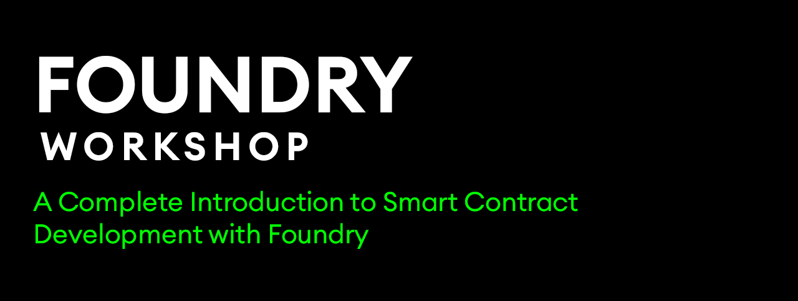
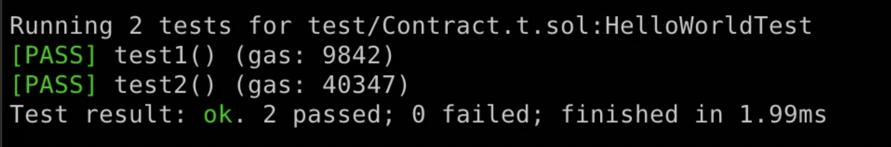

## Building and testing smart contracts with Foundry



> Also see [Foundry Book](https://book.getfoundry.sh/), [Foundry cheatsheet](https://github.com/dabit3/foundry-cheatsheet), and [this video tutorial](https://www.youtube.com/watch?v=uelA2U9TbgM)

In this workshop  you'll learn how to build, test, and deploy smart contracts with Solidity using Foundry. We'll start with an overview of the various CLIs and libraries that make up [Foundry](https://github.com/foundry-rs/foundry), what they do, and how to install them.

We'll then spin up a new project, walk through the file structure, and create an example smart contract. From there we'll create and run tests for the contract. Next, we'll run a local test Ethereum network, deploy the contract to the network, and use cast to call end execute transactions to the test network.

We'll then deploy the to Optimism to show how to deploy to a live network. Finally, we'll create an ERC721 contract and learn how to mock users to test out various functions like minting a token, transferring a token, and burning a token.

By the end of this workshop, you should have a good understanding of how Foundry works and how to use it to build, test, and deploy smart contracts.

### Prerequisites

To use Foundry, you must have [Rust](https://www.rust-lang.org/tools/install) installed on your machine.

### Foundry Overview
Paradigm's description of Foundry is that Foundry is a portable, fast and modular toolkit for Ethereum application development.

It fits into the stack the same way that Hardhat, Truffle, and Dapp Tools do.

The main differences / selling points of Foundry are:

1. It allows you to write your tests and scripts in Solidity instead of JavaScript.

    They make a great case about why writing tests in Solidity VS JavaScript is better, and they are spot on with most of their points.

    There is just a lot less boilerplate and a lot less mental overhead. Once you write a few tests in Solidity you feel the difference.

2. It's fast.

    Foundry is written in Rust and it is fast. They've documented a few benchmarks here, but it's hard to do it justice until you use it (especially after using an alternative).

3. Fuzzing - Fast fuzz testing with shrinking of inputs & printing of counter-examples

4. Flexible debug logging - dappTools-style, using DsTest's emitted logs, or Hardhat-style, using the console.sol contract

5. Fast CI with the [Foundry GitHub action](https://github.com/foundry-rs/foundry-toolchain).

## Foundry 

Foundry is made up of 3 CLI tools - [forge](https://github.com/foundry-rs/foundry/tree/master/forge), [cast](https://github.com/foundry-rs/foundry/tree/master/cast), and [anvil](https://github.com/foundry-rs/foundry/tree/master/anvil).

__Forge__ is the Ethereum development and testing framework.

__Cast__ is a CLI that allows you to interact with EVM smart contracts, send transactions, and read data from the network.

__Anvil__ is a local Ethereum node, similar to Ganache or Hardhat node.

### Building & testing a smart contract with Foundry

#### Prerequisites
To install Foundry, you must first have Rust installed on your machine.

#### Let's build

> If you have any issues with the installation instructions, you can see more detailed instructions [here](https://book.getfoundry.sh/getting-started/installation#install-the-latest-release-by-using-foundryup).

To get started, we'll install the latest release:

```sh
curl -L https://foundry.paradigm.xyz | bash
```

This will download `foundryup`. Then install Foundry by running:

```sh
foundryup
```

Next, in an empty directory, we can use the init command to initialize a new project:

```sh
forge init
```

The forge CLI will create a few files and folders, including `lib`, `src`, `script`, and `test`.

The `lib` directory contains `forge-std`, a collection of helpful contracts for use with forge and foundry.

The `src` directory contains a barebones smart contract.

The `test` directory contains an example test.

The `script` directory contains an example script.

Let's create a basic smart contract to test out. Rename `Counter.sol` to `HelloWorld.sol` and update it with the following:

```solidity
// SPDX-License-Identifier: MIT
pragma solidity ^0.8.13;

contract HelloWorld {
  string private greeting;
  uint public version = 0;
  
  constructor (string memory _greeting) {
    greeting = _greeting;
  }

  function greet() public view returns(string memory) {
    return greeting;
  }

  function updateGreeting(string memory _greeting) public {
    version += 1;
    greeting = _greeting;
  }
}
```

Next, let's update the name of `test/Counter.t.sol` to `test/HelloWorld.t.sol` and add the following code:

```solidity
// SPDX-License-Identifier: UNLICENSED
pragma solidity ^0.8.13;

import "forge-std/Test.sol";
import 'src/HelloWorld.sol';

contract HelloWorldTest is Test {
    HelloWorld hello;
    function setUp() public {
      hello = new HelloWorld("Foundry is fast!");
    }

    function test1() public {
        assertEq(
            hello.greet(),
            "Foundry is fast!"
        );
    }

    function test2() public {
        assertEq(hello.version(), 0);
        hello.updateGreeting("Hello World");
        assertEq(hello.version(), 1);
        assertEq(
            hello.greet(),
            "Hello World"
        );
    }
}
```

Next, we can run a build and compile the ABIs:

```sh
forge build
```

This should create an `out` directory containing the ABIs for both the main contract as well as the test.

### Tests

Forge comes built in with some really great testing features like assertions and gas cost snapshots.

In our test we've asserted equality using the `assertEq` utility.

To run the test, we can run:

```sh
forge test
```

When the test is run, we'll see output for not only the success of the test, but also the gas cost:



There are also utilities for:

truthiness - `assertTrue`

decimal equality - `assertEqDecimal`

greater than, less than - `assertGt`, asse`rtGe, `assertLt`, `assertLe`

You can view most of the assertions [here](https://book.getfoundry.sh/reference/ds-test#asserting).

### Fuzzing
Foundry also supports [fuzzing](https://en.wikipedia.org/wiki/Fuzzing).

This allows us to define function parameter types and the testing framework will populate these values at runtime.

If it does find an input that causes the test to fail, it will return it so you can create a regression test.

For instance, we can update the `test2` function to receive a function argument, and use the value in our test without ever having to define what it is:

```solidity
function test2(string memory _greeting) public {
    assertEq(hello.version(), 0);
    hello.updateGreeting(_greeting);
    assertEq(hello.version(), 1);
    assertEq(
        hello.greet(),
        _greeting
    );
}
```

Now when we run the test, Foundry will automatically populate the `_greeting` variable when the test is run.

### Logging

Foundry also supports logging.

To log out the greeting, we can use `log`, `log_string`, or `log_named_string`:

```solidity
function test2() public {
    assertEq(hello.version(), 0);
    hello.updateGreeting("Hello World");
    assertEq(hello.version(), 1);
    string memory value = hello.greet();
    emit log(value);
    assertEq(
        hello.greet(),
        "Hello World"
    );
}
```

To print the logs, we need to run the test script with the `-vv` flag:

```sh
forge test -vv
```

To learn more about logs and traces, check out the documentation [here](https://book.getfoundry.sh/forge/tests?highlight=-vv#logs-and-traces).

To view all of the supported logging methods, check out the documentation [here](https://book.getfoundry.sh/reference/ds-test#logging).

### Anvil

You can start the local EVM test network at any time:

```sh
anvil
```

This will start a local network and spin up 10 accounts and private keys and log them out to the console.

Once the network is running, we can use forge to deploy the contract to the network.

To do so, update the script in `script/Contract.s.sol`:

```solidity
// SPDX-License-Identifier: UNLICENSED
pragma solidity ^0.8.13;

import "forge-std/Script.sol";
import { HelloWorld } from 'src/HelloWorld.sol';

contract ContractScript is Script {
    function setUp() public {}

    function run() public {
        vm.broadcast();
        new HelloWorld("Hello from Foundry!");
    }
}
```

Next, set the `PRIVATE_KEY` variable by using one of the private keys given to you by Anvil:

```sh
export PRIVATE_KEY=<your-private-key>
```

To deploy, run this script:

```sh
forge script script/Contract.s.sol:ContractScript --fork-url http://localhost:8545 \
--private-key $PRIVATE_KEY --broadcast
```

Once the contract is deployed, the contract address will be logged out to your terminal.

Set the `CONTRACT_ADDRESS` variable in your terminal:

```sh
export CONTRACT_ADDRESS=<your-contract-address>
```

We can then use cast to interact with it.

For read operations, we can use cast call:

```sh
cast call $CONTRACT_ADDRESS "greet()(string)"
```

For transactions, we can use cast send, passing in a private key and any arguments:

```sh
cast send $CONTRACT_ADDRESS "updateGreeting(string)" "My new greeting" --private-key $PRIVATE_KEY
```

To test that the greeting has been updated, run the `call` command again:

```sh
cast call $CONTRACT_ADDRESS "greet()(string)"
```

## Installing packages

You can install packages using the `forge install` command.

To try this out, let's install OpenZeppelin Contracts, then we'll use them to create an ERC721 token:

```sh
forge install OpenZeppelin/openzeppelin-contracts
```

Next, create a file named `remappings.txt` in the root of the project and add the following configuration:

```
@openzeppelin/=lib/openzeppelin-contracts/
```

This will allow us to easily import with the following syntax:

```solidity
import "@openzeppelin/contracts/token/ERC20/ERC20.sol";
```

## ERC721 contract

With OpenZeppelin Contracts installed, let's create a new file named `ERC721.sol` in the `src` directory and add the following code:

```sh
//SPDX-License-Identifier: MIT
pragma solidity ^0.8.9;

import "@openzeppelin/contracts/token/ERC721/extensions/ERC721URIStorage.sol";
import "@openzeppelin/contracts/utils/Counters.sol";

contract DevconPanda is ERC721URIStorage {
    using Counters for Counters.Counter;
    Counters.Counter private _tokenIds;

    constructor() ERC721("DevconPanda", "DCP") {}

    function mint(address user, string memory tokenURI) public returns (uint256) {
        uint256 newItemId = _tokenIds.current();
        _mint(user, newItemId);
        _setTokenURI(newItemId, tokenURI);

        _tokenIds.increment();
        return newItemId;
    }
}
```

Next, let's write the test.

In the `test` directory, create a new file named `ERC721.t.sol` and add the following code:

```solidity
// SPDX-License-Identifier: UNLICENSED
pragma solidity ^0.8.13;

import "forge-std/Test.sol";
import 'src/ERC721.sol';

contract ERC721Test is Test {
    DevconPanda devconPanda;
    address noah = address(0x1);
    address sofia = address(0x2);

    function setUp() public {
      devconPanda = new DevconPanda();
    }

    function testMint() public {
      devconPanda.mint(noah, "testhash");
      address owner_of = devconPanda.ownerOf(0);
      assertEq(noah, owner_of);
    }
}
```

The `testMint` function will test that we have minted a token, and that the owner of that token belongs to the expected owner.

To try it out, run the `test` command:

```sh
forge test
```

As you can see, this command will run every test in the entire project.

If you'd like to only test a certain contract, you can run this command:

```sh
forge test --match-contract ERC721
```

### Mocking another user

Next let's look at the [prank](https://book.getfoundry.sh/cheatcodes/prank) cheatcode.

`prank` sets `msg.sender` to the specified address for the next call. "The next call" includes static calls as well, but not calls to the cheat code address.

This will allow us to mock, or simulate, whatever user we'd like to simulate in our test.

You can also use [startPrank](https://book.getfoundry.sh/cheatcodes/start-prank) which will set `msg.sender` for all subsequent calls until [stopPrank](https://book.getfoundry.sh/cheatcodes/stop-prank) is called.

Let's try using `prank` to transfer a token to another user.

Because we will be simulating the token owner, we should be able to transfer the token. If we were not simulating the token owner, the test should fail (feel free to give it a shot!).

To test this out, add the following function to the test:

```solidity
function testTransfer() public {
  devconPanda.mint(noah, "testhash");
  vm.startPrank(noah);
  devconPanda.safeTransferFrom(noah, sofia, 0);

  address ownerOf = devconPanda.ownerOf(0);
  assertEq(sofia, ownerOf);
}
```

Finally, let's check the balance of a user's address:

```solidity
function testBalance() public {
  devconPanda.mint(sofia, "testhash");
  devconPanda.mint(sofia, "testhash");
  devconPanda.mint(sofia, "testhash");

  uint balance = devconPanda.balanceOf(sofia);
  assertEq(balance, 3);
}
```

### Test coverage

You can check for test coverage by running the `coverage` command:

```sh
forge coverage
```

To debug in more details what has not been covered, use the `debug` report:

```sh
forge coverage --report debug
```

To learn more about what you can do with test coverage, check out [this](https://mirror.xyz/devanon.eth/RrDvKPnlD-pmpuW7hQeR5wWdVjklrpOgPCOA-PJkWFU) blog post or run `forge coverage --help`

### Conclusion

To learn more, check out the [Foundry Book](https://book.getfoundry.sh/), [Foundry cheatsheet](https://github.com/dabit3/foundry-cheatsheet), and [this video tutorial](https://www.youtube.com/watch?v=uelA2U9TbgM)